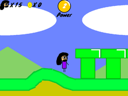

# 🐱 Scratch Projects Archive (.sb3)

Since my original account is gone, I've archived my most significant projects here. These represent years of work across the `JasonGlenEvans` and `Gvbvdxx` eras.

---

### 🌟 Featured Projects (Technical Breakdown)

| Preview | Project Name | Info & Features | Download |
| :--- | :--- | :--- | :--- |
|  | **Super Melney 2 (V.7)** | **The Flagship.** Features advanced physics, slope walking, and the **Aibo ERS-210 power-up**. My most complex logic build at 2.1MB. | [Download 💾](https://drive.google.com/file/d/1OCnr7gye9NXIln3dR5D2qR32fKhH-itM/view?usp=drive_link) |
|  | **Delta Sonic 360** | **V.2.2.** High-fidelity Genesis physics. Includes a **Bounce Back** system (restores momentum when running off walls) and hitbox slope detection. | [Download 💾](https://drive.google.com/file/d/1KqBjfjrSrzdmO2fJpoUY3Qr5eTshX9AV/view?usp=drive_link) |
|  | **Scratch Sonic Engine** | **My Most Popular Project.** Built using my "Pixel Probe" 360° logic. Features a full **Debug Mode** (Hold C+D). | [Download 💾](https://drive.google.com/file/d/1rIjphhkFid3A3dyaucXDVd3cql_XRoAu/view?usp=drive_link) |
|  | **GSE Sonic Cloud** | **Multiplayer Experiment.** Features **Synced Voice Clips** for Sonic, Tails, and Knuckles that trigger for everyone in the lobby. | [Download 💾](https://drive.google.com/file/d/1BgaeqMx5j9nnv6wW8NSjIToNYjmHkuvo/view?usp=drive_link) |
|  | **Scratch MIDI Player** | **Custom Data Pipeline.** Uses a proprietary format I call **"Gvbvdxx Commands"**. Powered by a custom Node.js backend. | [Download 💾](https://drive.google.com/file/d/1u6bfw5sm545Z55JVcioHUHJKsoWAYf5z/view?usp=drive_link) |

---

### 📂 Full Archive
[**Browse All Scratch Projects (Google Drive)**](https://drive.google.com/drive/folders/1l0u70F4CqF_ndKYMYE6lb1rSgkNHILKb)

### 🛠 Reupload & Modding Policy
You are welcome to reupload these to [Scratch](https://scratch.mit.edu) or mod them, but please respect the following:
* **Credit:** Mention `@gvbvdxx` in the Notes & Credits. 
* **The Intro:** For the Sonic Engines, the "Created with..." intro **must** remain intact.
* **Safety First:** If you share links, **only link to my YouTube**. Do not link to unmoderated chats! 🔨😾

---
[**⬅️ Back to profile**](../README.md)
