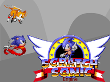
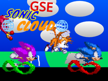

# 🐱 Scratch Projects Archive (.sb3)

Since my original account is gone, I've archived my most significant projects here. Feel free to download and run them in **TurboWarp** or any other Scratch player!

---

### 🌟 Featured Projects

| Preview | Project Name | Info & Features | Download Link |
| :--- | :--- | :--- | :--- |
|  | **Scratch Sonic Engine** | Classic Sonic physics framework. **Requirement:** Keep the original intro splash screen! *Performance Tip: Use [TurboWarp](https://turbowarp.org) for a smoother experience.* | [Download 💾](https://drive.google.com/file/d/1rIjphhkFid3A3dyaucXDVd3cql_XRoAu/view?usp=drive_link) |
|  | **GSE Sonic Cloud** | Multiplayer-ready; uses Genesis Sonic Engine. **Note:** Features cloud chat (check Stage code). | [Download 💾](https://drive.google.com/file/d/1BgaeqMx5j9nnv6wW8NSjIToNYjmHkuvo/view?usp=drive_link) |

---

### 📂 Full Archive
You can browse my entire collection of Scratch projects, including older versions and experiments, in the drive folder below:

[**Browse All Scratch Projects (Google Drive)**](https://drive.google.com/drive/folders/1l0u70F4CqF_ndKYMYE6lb1rSgkNHILKb)

---

### 🛠 Want more blocks & extensions?
If you want to take these projects (or your own) to the next level with features like **Gamepad Support**, check out **Gvbvdxx Mod 2**. You can find the source and links on the [main profile page](../README.md) under the **🛠️ Game Design Tools** section.

---

### 📜 Reupload Policy
You are welcome to reupload these projects to [Scratch](https://scratch.mit.edu), but please respect the following:

* **Credit:** Mention `@gvbvdxx` in the Notes & Credits. 
* **The Intro:** For the Sonic Engine, the "Created with..." intro **must** remain in the project. You are welcome to add your own intro *after* it.
* **Labeling:** If you are reuploading without making changes, you **must** state that the project is a reupload.
* **Links:** If you include a link, please **only link to my YouTube**. (Linking to unmoderated chats will get you banned by the Scratch Team! 🔨😾).
* **Modding:** Feel free to mod these! Just keep the original credit intact.

---

> [!TIP]
> **Pro-tip for Chromebook users:** If your school blocks Google Drive downloads, try opening these in the [TurboWarp Web Editor](https://turbowarp.org/editor) directly using the "File > Load from your computer" option after downloading.
